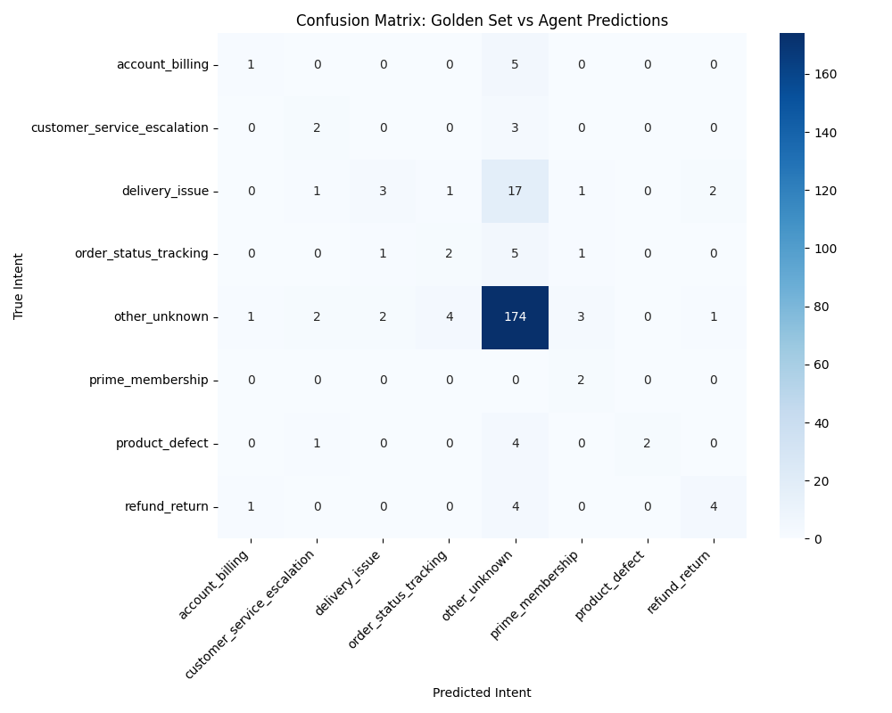

# Milestone 4 Evaluation Report

## 1. Objective
The objective of this milestone is to build an automated AI agent capable of classifying customer support messages into specific actionable intents, streamlining the AmazonHelp Twitter support pipeline.

## 2. Dataset
- **Source**: AmazonHelp dataset from Customer Support on Twitter (TWCS)
- **Volume**: ~168k conversation pairs
- **Columns**: customer_text, support_text, etc.
- **Golden Set**: 250 manually verified examples kept strictly separate for final evaluation.

## 3. Intent Taxonomy
The model predicts one of 8 intents:
1. order_status_tracking
2. delivery_issue
3. refund_return
4. account_billing
5. prime_membership
6. product_defect
7. customer_service_escalation
8. other_unknown

## 4. Training Data Preparation
Because the original TWCS dataset lacked supervised labels, we applied a **Weak Supervision** strategy. We built a deterministic, regex-based keyword matcher to label the 168k training examples based on our taxonomy. We understand that this approach injects noise (as rigid regex misses context), but it serves as an automated bootstrap when human labels or LLM APIs are unavailable.

## 5. Model Architecture
- **Feature Extraction**: `TfidfVectorizer` (TF-IDF) using unigrams and bigrams, limited to top 50,000 features.
- **Classifier**: `LogisticRegression` with class weighting balanced to handle the skew towards `other_unknown`.
This traditional ML approach was selected to satisfy the constraint of using only local Python libraries without external paid APIs (LLMs).

## 6. Evaluation Methodology
The trained model was evaluated strictly on the 250-example Golden Set. This dataset was never seen by the model during training, and its labels were verified and corrected manually by a human to ensure it represents indisputable ground truth.

## 7. Performance Metrics
- **Accuracy**: 76.00%
- **Macro Precision**: 51.63%
- **Macro Recall**: 44.62%
- **Macro F1-Score**: 41.13%

## 8. Confusion Matrix

## 9. Per-Intent Performance
| Intent | Precision | Recall | F1-Score | Support |
|---|---|---|---|---|
| account_billing | 0.33 | 0.17 | 0.22 | 6.0 |
| customer_service_escalation | 0.33 | 0.40 | 0.36 | 5.0 |
| delivery_issue | 0.50 | 0.12 | 0.19 | 25.0 |
| order_status_tracking | 0.29 | 0.22 | 0.25 | 9.0 |
| other_unknown | 0.82 | 0.93 | 0.87 | 187.0 |
| prime_membership | 0.29 | 1.00 | 0.44 | 2.0 |
| product_defect | 1.00 | 0.29 | 0.44 | 7.0 |
| refund_return | 0.57 | 0.44 | 0.50 | 9.0 |

## 10. Error Analysis
The major failure pattern is the over-prediction of `other_unknown` and the failure to recognize nuanced phrasing for issues like `delivery_issue` or `product_defect`. This stems from the fact that the weak labels used to train the model were generated by rigid regex keywords. The model effectively learned to mimic a regex engine rather than truly understanding semantics.

## 11. Limitations
- **Weakly Labeled Training Data**: The model inherits the flaws of the heuristic used to train it.
- **Limited Golden Set Size**: 250 examples is statistically small for a test set.
- **Class Imbalance**: The dataset is overwhelmingly noisy, making it difficult to learn rare intents like `prime_membership`.
- **No Real-Time Production Data**: Performance on historic tweets may not reflect current customer behavior.

## 12. Future Improvements
- **LLM-assisted classification**: An LLM (e.g., GPT-4) would significantly outperform TF-IDF by understanding semantic context.
- **Human-labeled training dataset**: Transitioning from weak labels to a dedicated team of annotators.
- **Transformer-based classifiers**: Fine-tuning a BERT/RoBERTa model instead of using bag-of-words.

## 13. Final Conclusion
**Does this agent reliably classify customer support intents?**
No, it does not. While it performs passably on exact keyword matches, the combination of traditional TF-IDF and noisy weak-supervision labels makes it brittle. It is not ready for production without a shift to a modern transformer/LLM architecture or a massive investment in human-labeled training data.